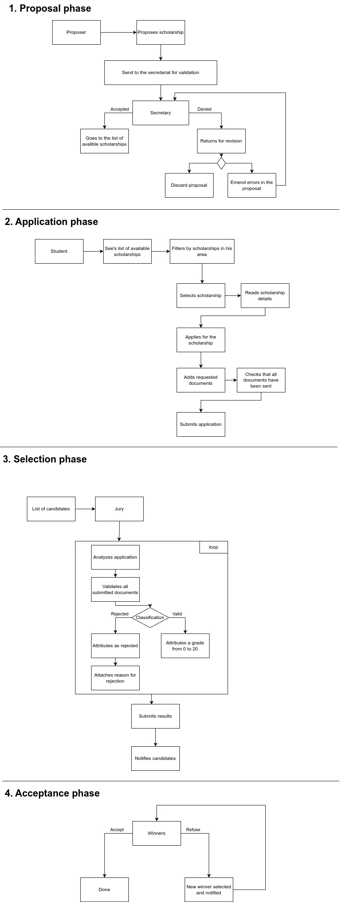
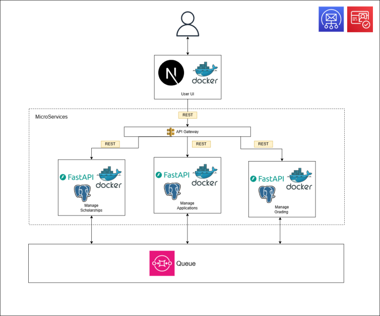

# Architecture

## Description

The architecture is built around a microservices-based model, allowing each core functionality to be decoupled and handled independently. The platform is designed with **high scalability, fault tolerance, and ease of deployment** in mind, using modern tools such as **[Next.js](https://nextjs.org/)**, **[FastAPI](https://fastapi.tiangolo.com/)**, **[Docker](https://www.docker.com/)**, **[MySQL](https://www.mysql.com/)**, and **[RabbitMQ](https://www.rabbitmq.com/)** for asynchronous communication.

## Workflow

The platform is designed to facilitate the following workflow:

## Frontend

The frontend is built using **Next.js**, which serves as the user interface for four key actors: **Students**, **Proposers**, **Secretaries**, and **Jury** members. It communicates with backend microservices via RESTful APIs and is secured using **AWS Cognito** for authentication through **[Auth.js](https://authjs.dev/)**.

## Backend

### API Gateway

The API Gateway manages incoming requests from the frontend and routes them to the appropriate microservices. It centralizes authentication, request validation, and routing, ensuring that only valid requests reach the backend.

### Microservices

All backend services are built using **FastAPI**, using **Docker** for containerization and **MySQL** for data storage. The backend is divided into four microservices:

- **Manage People**: This microservice is responsible for managing the platform's users, including **Students**, **Proposers**, **Secretaries**, and **Jury** members. It also manages user notifications, which are sent through **RabbitMQ**.

- **Manage Scholarships**: This service is responsible for creating, updating, and managing scholarships. Once a scholarship is proposed, it needs validation from the Secretary before becoming available for applications.

- **Manage Applications**: This service allows students to apply for available scholarships, submit the required documents, and track their application status.

- **Manage Grading and Selection**: After a scholarship is closed, this service facilitates the grading of applications by the jury, selection of candidates, and publication of results.

- **Notifications**: This service listens for various events (such as the submission of applications or announcement of results) and sends notifications to relevant actors (e.g., students, proposers, and jury members).

### Message Queue

**RabbitMQ** acts as the asynchronous communication layer, decoupling the services and ensuring that tasks like notification delivery and application processing happen without blocking other processes. This approach helps manage processes that do not need immediate synchronous responses and ensures scalability and resilience.

