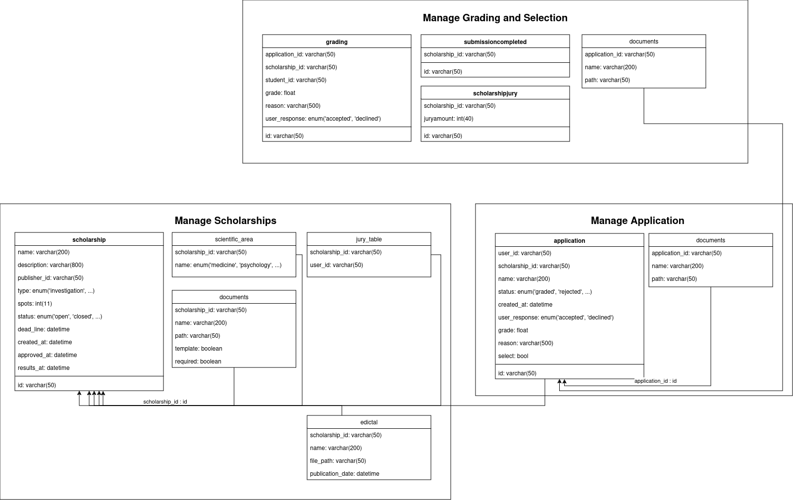

# Database Documentation

This document describes the entities in the Scholarship Management System and their roles within the platform.

## User
The `user` table stores information about individuals registered in the system. Users have specific roles such as *student*, *proposer*, *secretary*, and *jury*, which define their permissions in the system.

- `email`: Stores the user's email address.
- `name`: User's full name.
- `nMec`: A unique identifier, likely related to academic or personal identification.
- `hashedPassword`: A hashed version of the user's password for security purposes.
- `role`: Defines the user's role within the platform. Values are restricted to "student", "proposer", "secretary", or "jury".
- `created_at`: Timestamp indicating when the user was created.
- `updated_at`: Timestamp indicating the last time the user's information was updated.
- `id`: A unique identifier for the user.

## Scholarship
The `scholarship` table represents scholarship opportunities available in the system. These scholarships can have various types, slots, and statuses.

- `name`: The name of the scholarship.
- `description`: A longer description of the scholarship.
- `publisher_id`: A reference to the user who published or created the scholarship.
- `type`: Defines the type of scholarship (e.g., "Investigation").
- `slots`: Number of available slots for the scholarship.
- `status`: The current state of the scholarship, either "open" or "closed".
- `dead_line`: The deadline by which applications must be submitted.
- `created_at`: Timestamp of when the scholarship was created.
- `approved_at`: Timestamp of when the scholarship was approved.
- `results_at`: Timestamp of when the results for the scholarship will be available.
- `id`: Unique identifier for each scholarship.

## Grading
The `grading` table is used to store information about the evaluation of scholarship applications. Each record ties a specific user and scholarship to a grade.

- `application_id`: References the application that is being graded.
- `scholarship_id`: References the scholarship for which the application was submitted.
- `grade`: An integer value representing the grade awarded.
- `reason`: A text field explaining the rationale behind the grade.
- `timeStamp`: The date and time when the grade was assigned.
- `id`: Unique identifier for each grading entry.

## Application
The `application` table stores the records of users applying for scholarships. Each application is tied to a specific user and scholarship.

- `user_id`: References the user who submitted the application.
- `scholarship_id`: References the scholarship for which the user applied.
- `name`: Name of the application.
- `status`: Represents the state of the application (e.g., "graded", "rejected").
- `created_at`: Timestamp of when the application was submitted.
- `id`: Unique identifier for each application.

## Scientific Area
The `scientific_area` table categorizes scholarships based on academic disciplines.

- `scholarship_id`: References the scholarship associated with a specific scientific area.
- `name`: Defines the scientific area, such as "medicine", "psychology", etc.

## Jury Table
The `jury_table` links jurors to specific scholarships. Jurors are responsible for evaluating scholarship applications.

- `scholarship_id`: References the scholarship the juror is responsible for.
- `user_id`: References the juror assigned to evaluate the scholarship.

## Winner
The `winner` table stores the information about the winning applicants of scholarships.

- `grading_id`: References the grading associated with the winning application.
- `accepted`: Boolean value indicating whether the applicant accepted the scholarship.
- `timeStamp`: Timestamp when the winner decision was finalized.
- `id`: Unique identifier for the winner.

## Documents
The `documents` table stores files associated with various entities in the system (e.g., applications or scholarships).

- `scholarship_id` / `application_id`: Reference to the scholarship or application the document is associated with.
- `name`: Name of the document.
- `path`: File path where the document is stored.
- `template`: Boolean indicating whether the document is a template (for scholarships).
- `required`: Boolean indicating whether the document is required (for scholarships or applications).

## Edictal
The `edictal` table is related to the publication of formal notices regarding scholarships.

- `scholarship_id`: Reference to the scholarship the notice relates to.
- `name`: Name of the edictal document.
- `file_path`: Path where the edictal is stored.
- `publication_date`: Date when the edictal was published.

## Winners
The `winners` table is linked to the `scholarship` entity and stores information about the users who have won specific scholarships.

- `scholarship_id`: References the scholarship.
- `user_id`: References the user who won the scholarship.

# Database Diagram

